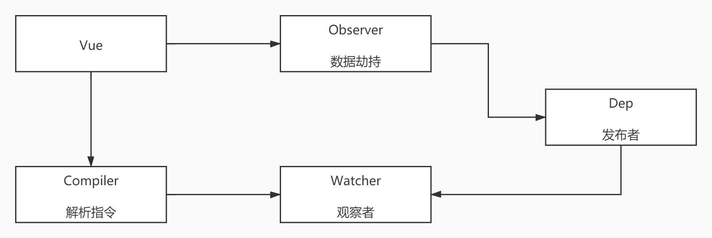

# Vue 响应式原理

### 数据驱动   

- 数据响应式

    - 数据模型仅仅是普通的 JavaScript 对象
    - 而当我们修改数据时，视图会进行更新，避免了繁琐的 Dom 操作，调高开发效率（核心）

- 双向绑定

    - 数据改变，视图改变；视图改变，数据也随之改变
    - 使用 v-model 在表单元素上创建双向数据绑定

- 数据驱动

    - 是 Vue 最独特的特性之一
    - 开发过程中仅需要关注数据本身，不需要关心数据是如何渲染到视图

### 响应式核心原理

- Vue 2.x
            
    - Vue 2.x 深入响应式原理（基于 defineProperty 实现）
    - Object.defineProperty
    - 浏览器兼容 IE8 以上（不兼容 IE8）<br/><br/>

    模拟 Object.defineProperty 使用
    ```
    // 模拟 Vue 中的 data 单个属性选项
    let data = {
        msg:'hello'
    }

    // 模拟 Vue 的实例
    let vm = {}

    // 数据劫持：当访问或者设置 vm 中的成员的时候，做一些干预操作
    Object.defineProperty(vm,'msg',{
        // 可枚举（可遍历）
        enumerable:true,
        // 可配置（可以使用 delete 删除，可以通过 defineProperty 重新定义）
        // 当获取值的时候执行
        get(){
            console.log('get: ', data.msg)
            return data.msg
        },
        set(newValue){
            console.log('set: ',newValue)
            if(newValue === data.msg){
                return 
            }
            data.msg = newValue
            // 数据更改，更新 DOM 的值
            document.querySelector('#app').textContent = data.msg
        }
    })

    // 测试
    vm.msg = 'Hello World'
    console.log(vm.msg)
    ```

    ```
    // 模拟 Vue 中的 data 多个属性选项
    let data = {
        msg:'hello',
        count:10
    }

    // 模拟 Vue 的实例
    let vm = {}

    proxyData(data)

    function proxyData(data){
        // 遍历 data 对象的所有属性
        Object.keys(data).forEach(key => {
            // 把 data 中的属性，转换成 vm 的 getter/setter
            Object.defineProperty(vm,key,{
                enumerable:true,
                configurable:true,
                get(){
                    console.log('get: ',key,data[key])
                    return data[key]
                },
                set(newValue){
                    console.log('set: ',key,newValue)
                    if(newValue === data[key]){
                        return 
                    }
                    data[key] = newValue
                    // 数据更新，更改 Dom 的值
                    document.querySelector('#app').textContent = data[key]
                }
            })
        })
    }

    // 测试
    vm.msg = 'Hello world'
    console.log(vm.msg)
    ```

- Vue 3.x

    - Proxy (Vue 3.x 响应式核心原理)
    - 直接监听对象，而非属性
    - ES6 中新增，IE 不支持，性能由浏览器优化<br/><br/>

    模拟 Proxy 代理对象使用
    ```
    // 模拟 Vue 中的 data 选项
    let data = {
        msg: 'hello',
        count:0
    }

    // 模拟 Vue 实例
    let vm = new Proxy(data,{
        // 执行代理行为的函数
        // 当访问 vm 的成员会执行
        get(target,key){
            console.log('get,key: ',key,target[key])
            return target[key]
        },
        // 当设置 vm 的成员会执行
        set(target,key,newValue){
            console.log('set,key: ',key,newValue)
            if(target[key] === newValue){
                return 
            }
            target[key] = newValue
            document.querySelector('#app').textContent = target[key]
        }
    })

    // 测试
    vm.msg = 'Hello World'
    console.log(vm.msg)
    ```

### 发布订阅模式和观察者模式

##### 发布/订阅模式

- 发布/订阅模式 

    - 订阅者
    - 发布者
    - 信号中心

    <br/>假定，存在一个“信号中心”，某个任务执行完成，就向信号中心“发布”（publish) 一个信号，其他任务可以向信号中心“订阅”（subscribe) 这个信号，从而知道什么时候自己可以开始执行。**这就叫做“发布/订阅模式”（publish-subscribe pattern)**

    <br/> Vue 自定义事件
    ```
    let vm = new Vue()

    // 注册事件（订阅消息）
    vm.$on('dataChange',() => {
        console.log('dataChange')
    })

    // 触发事件（发布消息）
    vm.$emit('dataChange')
    ```

    <br/> 兄弟组件通信过程
    ```
    // eventBus.js
    // 事件中心
    let eventHub = new Vue()

    // ComponentA.vue
    // 发布者
    addTodo:function(){
        // 发布消息（事件）
        eventHub.$emit('add-todo',{text:this.newTodoText})
        this.newTodoText = ''
    }

    // ComponentB.vue
    // 订阅者
    created:function(){
        // 订阅消息（事件）
        eventHub.$on('add-todo',this.addTodo)
    }
    ```

    <br/>模拟 Vue 自定义事件的实现
    ```
    // 事件触发器
    class EventEmitter{
        constructor(){
            // {'click':[fn1,fn2],'change':[fn]}
            this.subs = Object.create(null)
        }

        // 注册事件
        $on(eventType,handler){
            this.subs[eventType] = this.subs[eventType] || []
            this.subs[eventType].push(handler)
        }

        // 触发事件
        $emit(eventType){
            if(this.subs[eventType]){
                this.subs[eventType].forEach(handler => {
                    handler()
                })
            }
        }
    }

    // 测试
    let em = new EventEmitter()
    em.$on('click',() => {
        console.log('click1')
    })
    em.$on('click',() => {
        console.log('click2')
    })

    em.$emit('click')
    ```

##### 观察者模式

- 观察者（订阅者）-- Watcher

    - update(): 当事件发生时，具体要做的事情

- 目标（发布者）-- Dep

    - subs 数组：存储所有的观察者
    - addSub(): 添加观察者
    - notify(): 当事件发生，调用所有观察者的 update() 方法

- 没有事件中心

    <br/> 观察者模式原理模拟
    ```
    // 发布者-目标
    class Dep{
        constructor(){
            // 记录所有的订阅者
            this.subs = []
        }
        // 添加订阅者
        addSub(sub){
            if(sub && sub.update){
                this.subs.push(sub)
            }
        }
        // 发布通知
        notify(){
            this.subs.forEach(sub => {
                sub.update()
            })
        }
    }

    // 订阅者-观察者
    class Watcher{
        update(){
            console.log('update')
        }
    }

    // 测试
    let dep = new Dep()
    let watcher = new Watcher()

    dep.addSub(watcher)
    dep.notify()
    ```

##### 总结

- **观察者模式** 是由具体目标调度，比入当事件触发，Dep 就会去调用观察者的方法，所以观察者模式的订阅者与发布者之间是存在依赖的
- **发布/订阅模式** 由统一调度中心调用，因此发布者和订阅者不需要知道对方的存在


### Vue响应式原理模拟

##### 整体结构



- Vue 

    - 把 data 中的成员注入到 Vue 实例，并且把 data 中的成员转成 getter/setter

- Observer

    - 能够对数据对象的所有属性进行监听，如有变动可拿到最新值并通知 Dep

- Compiler

    - 解析每个元素中的指令与差值表达式，并替换成相应的数据

- Dep

    - 添加观察者，当数据发生变化的时候通知所有的观察者

- Watcher 

    - 内部有个 update 方法负责更新视图


##### Vue 

- 功能

    - 负责接收初始化的参数（选项）
    - 负责把 data 中的属性注入到 Vue 实例，转换成 getter / setter
    - 负责调用 observer 监听 data 中所有属性的变换
    - 负责调用 compiler 解析指令 / 差值表达式

- 代码

```
class Vue {
    constructor (options) {
        // 1. 通过属性保存选项的数据
        this.$options = options || {}
        this.$data = options.data || {}
        this.$el = typeof options.el === 'string' ? document.querySelector(options.el) : options.el

        // 2. 把data中的成员转成getter和setter，注入到vue实例中
        this._proxyData(this.$data)

        // 3. 调用observer对象，监听数据的变化
        new Observer(this.$data)

        // 4. 调用compiler对象，解析指令和差值表达值
        new Compiler(this)
    }

    _proxyData (data) {
        // 遍历data中的所有属性
        Object.keys(data).forEach(key => {
            // 把data的属性注入到vue实例中
            Object.defineProperty(this, key, {
                enumerable: true,
                configurable: true,
                get () {
                    return data[key]
                },
                set (newValue) {
                    if (newValue === data[key]) {
                        return 
                    }
                    data[key] = newValue
                }
            })
        })
        
    }
}
```


##### Observer

- 功能

    - 负责把 data 选项中的属性转换成响应式数据
    - data 中的某个属性也是对象，把该属性转换成响应式数据
    - 数据变化发送通知

- 代码

```
class Observer {
    constructor (data) {
        this.walk(data)
    }

    walk (data) {
        // 1.判断data是否是对象
        if (!data || typeof data !== 'object') {
            return
        }
        // 2. 遍历data对象的所有属性
        Object.keys(data).forEach(key => {
            this.defineReactive(data, key, data[key])
        })
    }

    defineReactive (obj, key, val) {
        let that = this
        // 负责收集依赖，并发送通知
        let dep = new Dep()
        // 如果val是对象，把val内部的属性转换成响应式数据
        this.walk(val)
        Object.defineProperty(obj, key, {
            enumerable: true,
            configurable: true,
            get () {
                Dep.target && dep.addSub(Dep.target)
                return val
            },
            set (newValue) {
                if (newValue === val) {
                    return 
                }
                val = newValue
                that.walk(val)
                // 发送通知
                dep.notify()
            }
        })
    }
}
```


##### Compiler

- 功能 

    - 负责编译模板，解析指令 / 差值表达式
    - 负责页面的首次渲染
    - 当数据变化后重新渲染视图

- 代码

```
class Compiler {
    constructor (vm) {
        this.el = vm.$el
        this.vm = vm
        this.compile(this.el)
    }

    // 编译模板，处理文本节点和元素节点
    compile (el) {
        let childNodes = el.childNodes
        Array.from(childNodes).forEach(node => {
            // 处理文本节点
            if (this.isTextNode(node)) {
                this.compileText(node)
            }else if(this.isElementNode(node)) {
                // 处理元素节点
                this.compileElement(node)
            }

            // 判断node节点，是否有子节点，如果有子节点，要递归调用compile
            if (node.childNodes && node.childNodes.length) {
                this.compile(node)
            }
        })
    }

    // 编译元素节点，处理指令
    compileElement (node) {
        // 遍历所有的属性节点
        Array.from(node.attributes).forEach(attr => {
            // 判断是否是指令
            let attrName = attr.name
            if (this.isDirective(attrName)) {
                attrName = attrName.substr(2)
                let key = attr.value
                this.update(node, key, attrName)
            }
        })
    }

    update (node, key, attrName) {
        let updateFn = this[attrName + 'Updater']
        updateFn && updateFn.call(this, node, this.vm[key], key)
    }

    // 处理 v-text 指令
    textUpdater (node, value, key) {
        node.textContent = value
        new Watcher(this.vm, key ,(newValue) => {
            node.textContent = newValue
        })
    }

    // 处理 v-model 指令
    modelUpdater (node, value, key)  {
        node.value = value
        new Watcher(this.vm, key ,(newValue) => {
            node.value = newValue
        })
        // 双向绑定
        node.addEventListener('input',() => {
            this.vm[key] = node.value
        })
    }

    // 编译文本节点，处理差值表达式
    compileText (node) {
        let reg = /\{\{(.+?)\}\}/
        let value = node.textContent
        if (reg.test(value)) {
            let key = RegExp.$1.trim()
            node.textContent = value.replace(reg, this.vm[key])
            // 创建watcher对象，当数据改变更新视图
            new Watcher(this.vm, key, (newValue) => {
                node.textContent = newValue
            })
        }
    }

    // 判断元素属性是否是指令
    isDirective (attrName) {
        return attrName.startsWith('v-')
    }

    // 判断元素属性是否是文本节点
    isTextNode (node) {
        return node.nodeType === 3
    }

    // 判断节点是否是元素节点
    isElementNode (node) {
        return node.nodeType === 1
    }
}
```


#### Dep(Dependency)


- 功能

    - 收集依赖，添加观察者（watcher）
    - 通知所有观察者

- 代码

```
class Dep {
    constructor () {
        // 存储所有观察者
        this.subs = []
    }

    // 添加观察者
    addSub (sub) {
        if (sub && sub.update) {
            this.subs.push(sub)
        }
    }

    // 发送通知
    notify () {
        this.subs.forEach(sub => {
            sub.update()
        })
    }
}
```


##### Watcher


- 功能

    - 当数据变化触发依赖，dep 通知所有的 Watcher 实例更新视图
    - 自身实例化的时候往 dep 对象中添加自己

- 代码

```
class Watcher {
    constructor (vm, key, cb) {
        this.vm = vm
        // data中的属性名称
        this.key = key
        // 回调函数负责更新视图
        this.cb = cb

        // 把watcher对象记录到Dep类的静态属性target
        Dep.target = this
        
        // 触发get方法，在get方法中会调用addSub
        this.oldValue = vm[key]
        Dep.target = null
    }

    // 当数据发生变化的时候更新视图
    update () {
        let newValue = this.vm[this.key]
        if (this.oldValue === newValue) {
            return
        }
        this.cb(newValue)
    }
}
```


##### 总结

- 整体流程回顾


- 给属性重新赋值成对象，该属性依然是响应式的
- 给 Vue 实例新增一个成员是非响应式的


